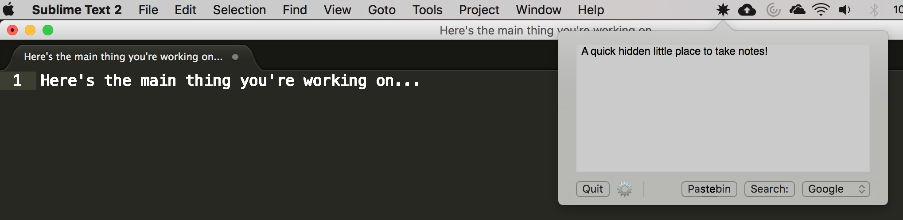

# Quickeys
A mac menu bar app that provides note taking and other functionality through a quick dropdown window. Please download the most recent release and drag the zip file to your Applications folder. From there, double click the zip file to unpack the application. After doing so, you may delete the zip file.

## Building and running

1. Install `cocoapods` if you do not have it already. Run either `sudo gem install cocoapods` or `brew install cocoapods`, whichever you prefer.
1. Run `pod install` in the root of the cloned repository.
1. Install `carthage` if you don't have it already.
1. Run `carthage bootstrap` in the root of the cloned repository.
1. Open `Quickeys.xcworkspace` in Xcode.
1. Click the Play button (build and run the current scheme) in Xcode

Quickeys should now be running!



## Features
Quickeys has a variety of smaller hidden features:

* Press `cmd + shift + 8` to toggle the Quickeys window from anywhere on your computer
* Press `cmd+enter` to search highlighted or all text on target
* Press `alt/option + enter` to generate and copy a [pastebin](http://pastebin.com/) link of highlighted or all text
* Click and drag anywhere outside of the text box and buttons to resize the window vertically
* Autosaves your notes so they do not get lost if you quit the app.

## Contributing
If you are looking to run or contribute to this project, you will need an ApiKeys.plist file for the pastebin functionality to work. The file should be placed in the Resources directory, and should contain a single key-value pair:

```xml
<?xml version="1.0" encoding="UTF-8"?>
<!DOCTYPE plist PUBLIC "-//Apple//DTD PLIST 1.0//EN" "http://www.apple.com/DTDs/PropertyList-1.0.dtd">
<plist version="1.0">
<dict>
    <key>API_KEY</key>
    <string>your-key-here</string>
</dict>
</plist>
```

### Pods
Please download cocoapods and run `pod install` upon cloning this directory. This will create the required `Quickeys.xcworkspace`, which should be opened to edit the project.

This project uses [MASShortcut](https://github.com/shpakovski/MASShortcut).

## License
This project is licensed under the BSD-3-Clause.
The full license can be viewed [here](LICENSE).
